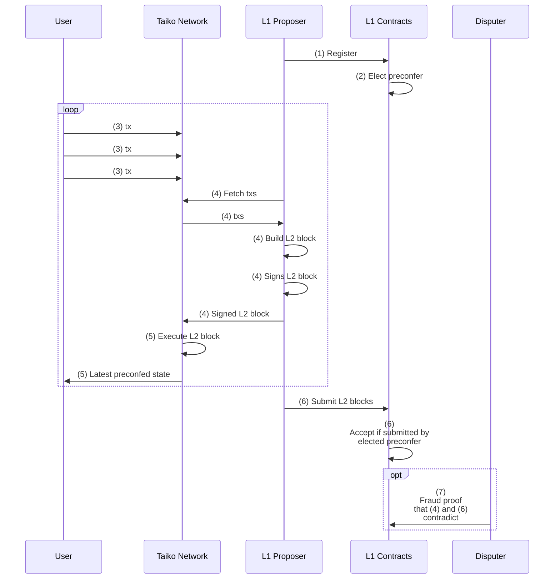
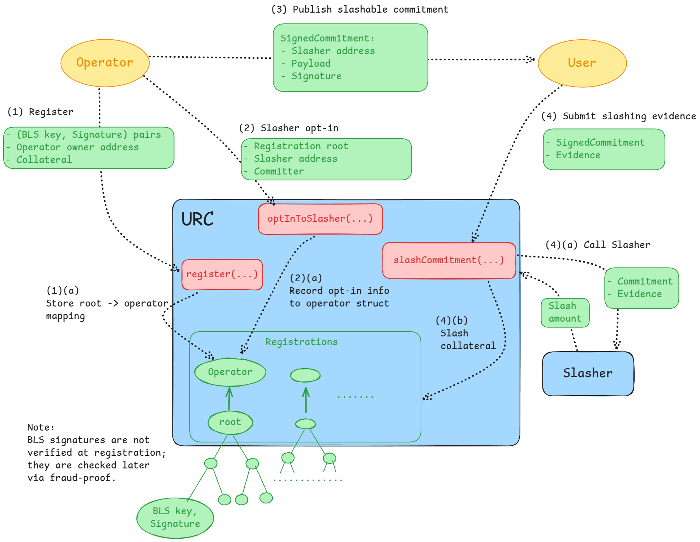
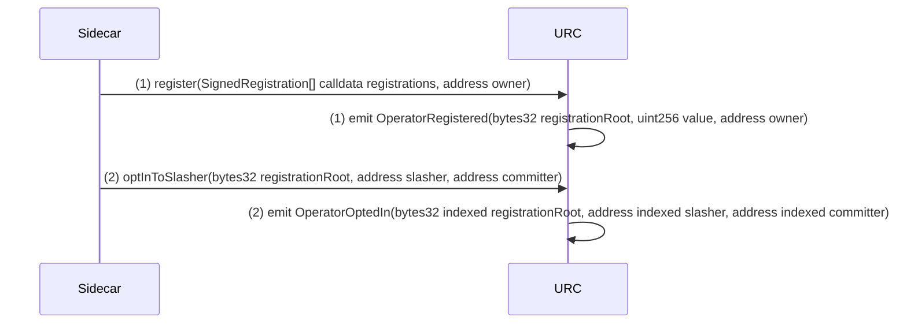
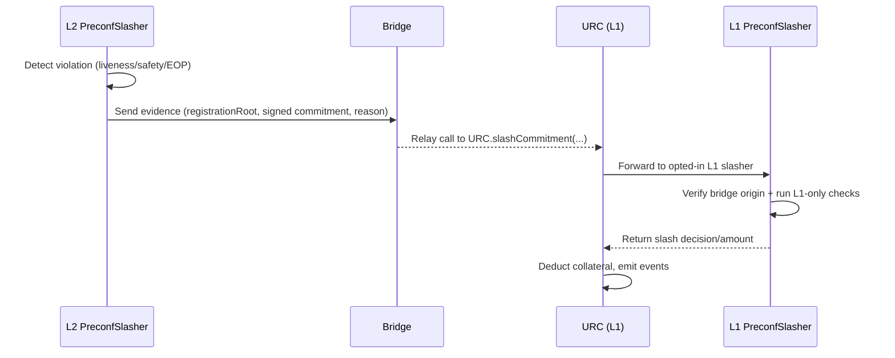
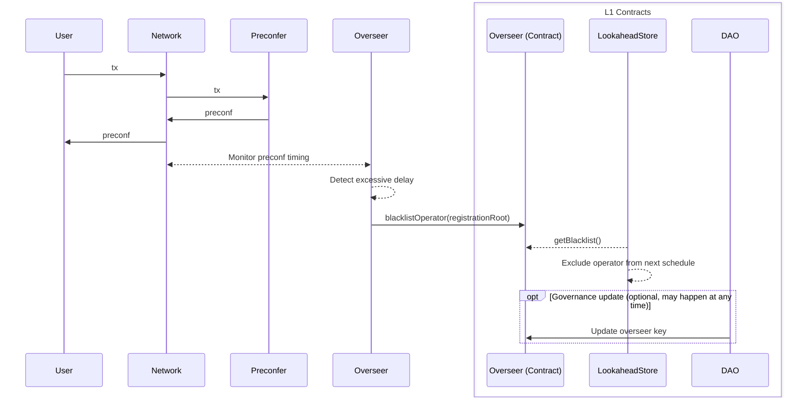

# [Ext] [Design Doc] Taiko Permissionless Preconfirmations

# Introduction

Since Taiko is a [based rollup](https://ethresear.ch/t/based-rollups-superpowers-from-l1-sequencing/15016/), users must wait for the L1 block proposal (~12 seconds) to know whether and how their transaction is included in a Taiko L2 block. This results in a degraded user experience compared to non-based rollups, which can provide *preconfirmations* (commitments to transaction results) in much shorter time frames by utilizing their centralized sequencers.

In August 2025, Taiko introduced whitelisted preconfirmations on mainnet, where preconfirmations are provided by a set of whitelisted entities. While this design improves on traditional centralized sequencers by avoiding reliance on a single preconfer and by supporting multiple client implementations, it is a whitelisted, permissioned system.

In this post, we outline a design for the next step, removing the whitelist and enabling *permissionless preconfirmations* (also known as [*based preconfirmations*](https://ethresear.ch/t/based-preconfirmations/17353)) on Taiko.

📝 **Note:** This post omits ***preconfirmation delegation***, where an L1 proposer outsources some or all preconfirmation duties to another entity. We will cover that topic in a separate post.

# Overview

At a high level, the protocol will work as follows:

- Each L1 slot is divided into smaller “L2 slots” (e.g., 2 second L2 slots).
- At the end of each L2 slot, the preconfirmer, who is elected from the opted-in L1 proposers, will build, sign, and publish Taiko L2 blocks to the network (i.e., they will *preconfirm* an L2 block).
- Taiko users will listen to these preconfed L2 blocks to know the result of their L2 transaction without waiting for L1 inclusion.

## The Seven Steps for Preconfirmations

Based preconfirmations consist of the following seven steps:

- **Step 1: Registration**: L1 proposers lock collateral and opt-in to provide preconfirmations (i.e., to become the *preconfer*).
- **Step 2: Election**: A single opted-in L1 proposer is chosen to be the preconfer for a given time window.
- **Step 3: Request submission**: L2 users submit transactions for which they wish to receive preconfirmations.
- **Step 4: Preconfirmation publication**: The elected preconfer provides the preconfirmations.
- **Step 5: Preconf reception**: L2 node operators update their local L2 state based on the preconfed transactions.
- **Step 6: L1 inclusion**: The preconfer submits the preconfed transactions to the L1 inbox.
- **Step 7: Preconf Equivocation Slashing**: Slash the preconfer if the preconfirmations provided in step 4 contradict what was included in step 6.

The following sequence diagram is a high-level illustration of how these seven steps will be executed in our PoC design:



## Components/Terminology

The preconfirmation protocol consists of the following high-level components:

- **URC:** A shared registry that standardizes how proposers register, post collateral, make commitments, and enforce slashing for equivocation.
- **Taiko Node:** The L2 node responsible for producing, validating, executing, and relaying L2 blocks. In the implementation, this is separated into `taiko-driver` and `taiko-geth`, but we omit that distinction in this document.
- **Taiko Inbox Contract:** The L1 contract that receives proposed L2 blocks.
- **Preconfirmation P2P**: A P2P network where preconfirmations are published.
- **Preconfirmation Sidecar (or just the Sidecar):** A service running alongside the Taiko node that handles preconfirmation logic, including registration, maintenance of the lookahead, publication of preconfs to P2P, and handling of slashing when any other preconfer equivocates.
- **Lookahead Contract:** A contract that defines the schedule (= the *lookahead*) of eligible preconfirmers for upcoming slots and epochs.
- **Slashing Contract:** A contract that enforces penalties when commitments are broken. The contract is passed to the URC, which then calls it to handle the slashing logic.
- **Anchor ID:**  The block ID of the L1 block whose L1 blockhash (= *anchor hash*) is imported into L2 via the anchor transaction. The anchor ID is chosen by the preconfer for that block.
- **Anchor transaction:** A special L2 transaction placed at the top of each L2 block. It calls the anchor contract to synchronize L2 with L1 state and perform other required updates.
- **Anchor Contract:** An L2 contract that synchronizes data from L1 to L2 for cross-layer communication. This data is injected into the anchor contract through special *anchor transactions*, which are always included as the first transaction in every L2 block. Furthermore, the anchor contract stores historical L2 block information (raw transaction list + anchor ID).
- **Raw Transaction List (`rawTxList`)**: The L2 block’s transaction list, excluding the anchor transaction. It is unfiltered (= *raw*) and may include duplicate/invalid transactions, which will be filtered out later in L2 execution.

## Background: URC

For the registration of L1 proposers, we utilize the **[Universal Registration Contract (URC)](https://www.notion.so/143f46539a18809095adf4a14a5ff216?pvs=21),** a shared, neutral on-chain registry that standardizes the registration process, the posting of collateral, the making of commitments, and the handling of slashing for commitment equivocation. URC lowers barriers to entry by removing the need for custom registries and separate collateral in each proposer commitment protocol.

Here is an overview diagram of URC:



- (1) The operator submits a list of validator BLS key/signature pairs, the operator's *owner address* (the ECDSA key that can act on behalf of the set of BLS keys), and collateral to the URC.
    - (a) The Merkle root of the validator batch is calculated, and only the root is stored on-chain. This root maps to an *Operator* record that contains information such as the owner address, collateral amount, and opted-in slashing contracts.
    - Note: The individual BLS signatures are not yet verified on-chain. Instead, they are checked through an optimistic fraud-proof mechanism, where anyone can slash an operator who submitted an invalid signature.
    - Note: The operator must wait for the fraud-proof window before proceeding to the next step.
- (2) Operator opt-in into a protocol by passing the slasher address and the committer address. The slasher address is the address of the contract that handles slashing for that protocol, and the committer address is the address that will sign the commitments, which can be the same as the owner address.
    - (a) The opt-in information is recorded into the operator struct.
- (3) The operator creates, signs, and publishes a URC-compatible preconf commitment, which includes the slasher address, payload, and signature.
- (4)  A user who detects equivocation submits signed commitments and evidence that proves the equivocation.
    - (a) The URC forwards the commitment and evidence to the slashing contract specified in the commitment. The slashing contract checks the evidence and returns the slash amount.
    - (b) The URC enforces the penalty by slashing the operator’s collateral for the returned amount.

📝 **Note:** 
This is a simplified explanation of URC. For example, it does not cover delegation. For more technical details of the URC, refer to [this document](https://www.notion.so/143f46539a18809095adf4a14a5ff216?pvs=21) or their [public repository](https://github.com/ethereum-commitments/urc).

# Implementation

We will outline how the PoC will implement each step of the seven-step preconfirmation process.

## Step 1: Registration

### Registration Flow

The registration flow to the URC is illustrated in the following sequence diagram:



- (1) The sidecar submits a batch of validator registrations to the URC via `register()`. The URC stores the Merkle root of the batch and emits an `OperatorRegistered` event with the registration root, collateral value, and owner.
- (2) The sidecar then calls `optInToSlasher()` to associate the registration root with a chosen slashing contract. The URC confirms this by emitting an `OperatorOptedIn` event.

### The URC Indexer

The URC does not explicitly store the mapping from BLS keys to registration roots on-chain in order to reduce costs. However, the sidecar requires this full mapping to construct and submit the lookahead (more on lookahead handling in the next section). To bridge this gap, the sidecar must run an indexer that tracks URC events and locally reconstructs and manages the mapping. Namely, the indexer will manage the following mappings:

- BLS key → registration root(s) mapping.
- registration root → `Operator` struct mapping.

The detailed design of this component is outside the scope of this document.

## Step 2: Election

### Overview

The election step determines which L1 proposer is authorized to provide preconfirmations for a given L1 slot. At the high level, the preconfer for a given slot is

- the next L1 proposer in the proposer lookahead, who also
- opted in to being a preconfer in the URC.


At the core of the election mechanism is the *lookahead store contract*, which records the preconfer schedule for upcoming slots. This schedule is maintained through an ***optimistic submission scheme,*** where ****the first preconfer of each epoch is responsible for submitting the schedule for the next epoch. The submission is accepted without full validation, and if it is incorrect, anyone can provide a fraud proof to the lookahead slasher. More on slashing in [Lookahead Slashing](https://www.notion.so/Lookahead-Slashing-25b360fc38d0800ebaa8c432fb546c3a?pvs=21) section.


📝 **Note:** You may be wondering why the lookahead is optimistic, especially after [EIP-7917](https://eips.ethereum.org/EIPS/eip-7917). This is because fully validating a lookahead would require not only proving that a validator is the proposer for a given slot and has opted in to preconfs, but also proving that other proposers for that epoch have *not* opted in to preconfs. In other words, it would require proof of non-inclusion in the URC registration trees. Generating and verifying such non-inclusion proofs would require significant complexity.

### Fallback Preconfer

If no L1 proposer is opted in the remainder of the lookahead, the remaining slots are assigned to a fallback preconfer.


The fallback can be selected from either a whitelisted set of entities or the pool of opted-in proposers. For the first iteration, we recommend using a whitelist, as it acts as a training wheel when opt-in rates are low while migrating to permissionless preconfing. The fallback whitelist preconfer will rotate for each epoch.

This fallback preconfer must submit their preconfed L2 blocks to the Taiko inbox contract through the public mempool or builder APIs, rather than including them directly in their proposed blocks, since they are not the L1 proposer for any slot in the epoch. More on this in the L1 inclusion section.

📝 **Note:** Instead of allocating whole epochs to the fallback, we may want to allocate first X slots of the epoch.

### Lookahead Submission

The lookahead is represented as an array of `LookaheadSlot`s, one for each preconfer in the lookahead:

```solidity
struct LookaheadSlot {
    // The committer address of the preconfer of the slot.
    address committer;
    // Final timestamp the preconfer can use to submit their L2 block(s) to L1
    uint256 submissionWindowEnd;
    // URC registration root of the operator
    bytes32 registrationRoot;
    // Index of the Operator's registration merkle tree leaf that contains
    // the validator for the slot.
    uint256 validatorLeafIndex;
}
```

The diagram below illustrates how proposers (P0–P7) are mapped to preconfers across slots, and how these assignments are recorded in the `LookaheadSlot[]` structure:


**About `submissionWindowEnd`:**

Each `LookaheadSlot` carries an `submissionWindowEnd`, the deadline by which the elected preconfer must submit their L2 block(s) for that slot.

If the preconfer is also the L1 proposer, this timestamp corresponds to their L1 proposing slot. If the preconfer is a fallback preconfer, it marks the end of the allocated epoch (or other agreed allocation of fallback preconfer).

Its primary role is slashing attribution ****(as we see in later slashing sections): it serves as the canonical “window ID” when comparing preconfed vs. submitted blocks, helping distinguish whether a mismatch is due to the current preconfer or previous preconfer.

**Lookahead Submission as URC Commitments:**

When posted to the lookahead store, the `LookaheadSlot[]` array is wrapped in a **URC-compatible commitment**. This ensures that the lookahead can, if invalid, be used as evidence in the URC for slashing.

```solidity
struct SignedCommitment {
    LookaheadCommitment commitment;
    // ECDSA signature of keccak256(abi.encode(commitment))
    // by the lookahead poster.
    bytes signature;
}

// Readable version specific to lookahead commitments
struct LookaheadCommitment {
    address slasher;                // The lookahead slashing contract
    LookaheadSlot[] lookaheadSlots; // The committed lookahead
}
```

### Lookahead Slashing

We retroactively slash if the submitted lookahead is found to be invalid. This occurs in the following cases:

- **Invalid operator assignment**: A slot is assigned to the wrong operator. I.e., the validator BLS of a slot, which is available via [EIP-7917](https://eips.ethereum.org/EIPS/eip-7917), isn’t mapped to the operator address provided in the lookahead.
- **Missing eligible operator**: An eligible L1 proposer who was registered, opted-in, had sufficient collateral, and wasn't blacklisted was omitted from the lookahead when they should have been included.

When slashing occurs for an invalid lookahead, the invalid value is retained and not overwritten. Alternatives include having the slasher submit the correct lookahead or falling back to the fallback preconfer. In practice, because an invalid lookahead can be slashed for the full amount, there should be little to no economic incentive to intentionally invalidate the lookahead. Alternative mechanisms may be considered in future iterations.

## **Step 3: Request Submission**

Preconfirmation requests from users will be submitted as usual Taiko transactions via the existing Taiko public mempool. Transactions with higher L2 priority fees are more likely to be preconfed, as the L2 priority fee is allocated to the preconfer. Once we have delegation, transactions may be sent to the delegated entity through private channels. Delegation will be covered in a future write-up.

## Step 4: Preconfirmation Publication

For slots in which a preconfer is elected, the preconfer commits and publishes a `Preconfirmation` object. 

```solidity
// The object that is preconfed
struct Preconfirmation {
    // End of preconfirmation flag
    bool eop;
    // Height of the preconfed block
    uint256 blockNumber;
    // Timestamp of the preconfed block
    uint256 timestamp;
    // Gas limit for the preconfed block
    uint256 gasLimit;
    // Coinbase address (recipient of block rewards)
    address coinbase;
    // Height of the L1 block chosen as anchor for the preconfed block
    uint256 anchorBlockNumber;
    // Hash of the raw list of transactions included in the block
    bytes32 rawTxListHash;
    // The hash of the parent preconfirmation
    bytes32 parentPreconfirmationHash;
    // The timestamp of the preconfer's slot in the lookahead
    uint256 submissionWindowEnd;
    // Prover authorization for the block
    address proverAuth;
    // Proposal ID for the block
    uint256 proposalId;
}
```

Furthermore, the preconfer also publishes the `rawTxList` of the block together with the `Preoconfirmation` object.

In order to make the `Preconfirmation` an actual commitment that is slashable in the URC, the `Preconfirmation` is wrapped in a `SignedCommitment` as follows:

```solidity
struct PreconfCommitment {
    Preconfirmation preconf;
    address slasherAddress;  // Preconf slashing contract
}

struct SignedCommitment {
    PreconfCommitment commitment;
    // ECDSA signature of keccak256(abi.encode(commitment))
    bytes signature;
}
```

Before handing off to the next preconfer, the elected preconfer must set `eop=true` in their final `Preconfirmation`.

### Design Choice: rawTxList vs. Blockhash

An alternative to committing to rawTxList/anchorID would be to commit to the blockhash of the L2 block. We chose not to do this because anchor reorgs would cause the blockhash to change even when the preconfer behaved honestly, exposing them to unjustified slashing.

This would create a strong incentive to anchor to older, “safer” L1 blocks, which would in turn worsen L1→L2 message latency. By contrast, committing to rawTxList/anchorID avoids this problem entirely while preserving clear and enforceable slashing guarantees.

### End-of-Preconfirmation (EOP)

The ***End-of-Preconfirmation (EOP)*** is a signed commitment that no further preconfs will be published for the current window. It enables the next preconfer in the lookahead schedule to begin publishing preconfs and provides a clear, slashable handover from one preconfer to the next.

While EOP is particularly crucial for fallback preconfers who do not have an L1 slot and must stop preconfirming early to focus on submitting their L2 blocks through the mempool or builder APIs, it is also important for non-fallback preconfers. For non-fallback L1 proposers, there is always a delay while the L1 block propagates, so without an explicit EOP, there could be unnecessary gaps of up to several seconds where no preconfs are published.

As we see in “Step 6: Slashing”, failure to issue an EOP for the last block in a window is slashable, and so is publishing additional preconfs after an EOP.

### Special Case: EOP-only Preconfirmation

In some cases, it may be unprofitable or impractical for a preconfer to perform any preconfirmation duties during their allocated slot (e.g., they are allocated too few slots to cover the L1 submission cost via L2 fees), leading them to consider skipping their window entirely.

In such cases, the preconfer may publish a single ***EOP-only preconfirmation*** where `rawTxListHash = 0x0` without preconfing any actual L2 blocks in their window.

EOP-only preconfirmations must never be slashable for blockhash mismatches, since no L2 block is being committed. Slashing only happens if the preconfer later publishes additional preconfs after issuing the EOP-only preconfirmation (i.e., a post-EOP submission fault we see later).

When all preconfers in the lookahead skip their window via EOP-only preconfs, the fallback preconfer should handle the preconfs for that epoch.

## Step 5: Preconfirmation reception

Any Taiko full node can subscribe to the preconf P2P network and update its local L2 state from the data published by the elected preconfer. Each publication contains:

- The `SignedCommitment` that contains the `Preconfirmation` together with a URC-compatible commitment.
- The corresponding L2 raw transaction list whose hash matches the `rawTxListHash` in `Preconfirmation`.

Validation of preconfs and the resulting state updates is handled as follows:

```python
# Entry in the lookahead schedule
class LookaheadSlot:
    committer: address   # preconfer address
    submissionWindowEnd: uint256
    ...  # Unchanged

# Address of the preconf slasher
PRECONFER_SLASHER_ADDRESS = ....

# The currently expected preconfer
currentPreconfer: LookaheadSlot

# Node's preconfed L2 head state
# Based on `ParentState` in Rust implementation, but extended with `rawTxListHash`:
# https://github.com/taikoxyz/taiko-mono/blob/0ca71a425ecb75bec7ed737c258f1a35362f4873/packages/taiko-client-rs/crates/driver/src/derivation/pipeline/shasta/pipeline/state.rs#L12-L13
class ParentState:
    header: Header             # Standard block header (hash, number, timestamp, gasLimit, coinbase, etc.)
    preconfirmationHash: bytes32     # New! Hash of preconfirmation
    proposalId: uint256        # New! Incremental ID for each L1 proposal
    ...

localL2Head: ParentState

# Run this function on each reception of preconf
def verifyPreconfirmation(rawTxList: List[Tx], signedCommitment: SignedCommitment):
    """
    Verifies a received preconfirmation against lookahead schedule, the signer,
    the slasher address, and derive and execute the L2 block.
    """

    commitment = signedCommitment.commitment
    preconf = commitment.preconf
    slasher = commitment.slasherAddress

    # 1) Check that preconfer is committing to the expected slasher address 
    assert slasher == PRECONFER_SLASHER_ADDRESS

    # 2) Rotate if the current LookaheadSlot has expired
    if now() > currentPreconfer.slotTimestamp:
        currentPreconfer = lookaheadStore.getCurrentPreconfer()

    # 3) Verify signer is the current LookaheadSlot committer
    commitmentHash = hash(commitment)
    signer = ECDSA.recover(commitmentHash, signedCommitment.signature)
    assert signer == currentPreconfer.committer

    # 4) Verify the submissionWindowEnd matches
    expectedTimestamp = currentPreconfer.submissionWindowEnd
    assert preconf.submissionWindowEnd == expectedTimestamp

    # 5) Verify parent consistency
    assert preconf.parentPreconfirmationHash == localL2Head.preconfirmationHash

    # 6) Verify rawTxList consistency
    assert hash(rawTxList) == preconf.rawTxListHash

    # 7) Verify timestamp does not drift too far from current time
    assert abs(preconf.timestamp - now()) <= MAX_TIMESTAMP_DRIFT

    # 8) Verify timestamp, gasLimit, coinbase, proverAuth, based on
    #    logic in derivation.
    # TODO: Revisit once derivation is refactored 
    #       to handle per-block derivation.
    verifyTimestamp(preconf.timestamp, preconf.proposalId, parentState)
    verifyGasLimit(preconf.gasLimit, parentState)
    verifyCoinbase(preconf.coinbase, currentPreconfer.committer)
    verifyProverAuth(preconf.proverAuth)

    # 9) Derive L2 block from preconfirmation and execute it
    # First construct block manifest from preconfirmation parameters.
    # Block manifest in Rust implementation::
    # https://github.com/taikoxyz/taiko-mono/blob/0ca71a425ecb75bec7ed737c258f1a35362f4873/packages/taiko-client-rs/crates/protocol/src/shasta/manifest.rs#L22-L23
    manifest = BlockManifest(
        anchorBlockNumber=preconf.anchorBlockNumber,
        timestamp=preconf.timestamp,
        gasLimit=preconf.gasLimit,
        coinbase=preconf.coinbase,
        proverAuth=preconf.proverAuth,
        proposalId=preconf.proposalId,
        transactions=rawTxList
    )    
    # Then process block.
    # This validates constraints, constructs anchor tx, and executes the block.
    # Corresponds to `process_block_manifest` in Rust implementation:
    # https://github.com/taikoxyz/taiko-mono/blob/0ca71a425ecb75bec7ed737c258f1a35362f4873/packages/taiko-client-rs/crates/driver/src/derivation/pipeline/shasta/pipeline/payload.rs#L290
    # Note: This function will update the `parentState` with the newly processed block.
    processBlockManifest(manifest, parentState)

    # 10) Handle explicit EOP handoff
    if preconf.eop:
        currentPreconfer = lookaheadStore.getNextPreconfer()

# Hook function called on L1 reorgs
def handleL1Reorg(reorgedAnchorIds: List[int]):
    """
    Handles L1 reorgs by re-fetching anchor hashes for affected anchor IDs,
    re-executing affected L2 blocks, and updating local state.
    """
    for block in getAffectedL2Blocks(reorgedAnchorIds):
        newAnchorHash = getL1AnchorHash(block.anchorId)
        newAnchorTx = constructAnchorTx(block.anchorId, newAnchorHash)
        reexecuteL2Block([newAnchorTx] + block.rawTxList, block)
```

## Step 6: L1 Inclusion

The preconfers will need to eventually include their preconfed L2 transactions in the L1 to avoid being slashed. There are two scenarios to consider, depending on when this inclusion happens:

- **The preconfer is the proposer of the current slot**:
    - The preconfirmer will submit the list of preconfed transactions to the L1 builders via the [constraints API](https://github.com/eth-fabric/constraints-specs).
- **The preconfer is not the proposer of the current slot**:
    - The preconfer will submit the list of preconfed transactions via the L1 public mempool or private RPC of the builder.

## Step 7: Preconf Equivocation Slashing

Preconf equivocation can be categorized into four categories:

- **Block commitment mismatch:** The preconfer failed to honor the rawTxList, anchor ID, timestamp, gas limit, coinbase, proverAuth, or proposalId they preconfed.
- **Missed submission**: The preconfer did not submit the preconfed block to the Taiko inbox.
- **Invalid EOP:** The preconfer included additional L2 blocks after their `EOP=true` block.
- **Missing EOP:** The preconfer did not include set `EOP=true` in their final preconfed block.

Let's examine each category in detail.

### Block Commitment Mismatch Slashing

Slash when the rawTxList/anchorID/timestamp/gasLimit/coinbase/proverAuth/proposalId for a given L2 block ID differs between:

- The block is **preconfed** and published on the P2P network.
- The block was **submitted** to L1 and later proven.

For example, in this diagram, the preconfed block `B1` (preconfed in P2P) and the submitted block `B1′` (submitted to L1) have different rawTxList/anchorID/timestamp/gasLimit/coinbase/proverAuth/proposalId for the same L2 block ID. 


Note that slashing occurs after the submitted blocks are proven and the L2 execution result is settled to L1.

Furthermore, we should not always slash the preconfer of `B1` when this mismatch occurs, because it may not be their fault but rather the previous preconfer’s fault.

**Edge case: EOP Violation by Previous Preconfer**


This case occurs when the previous preconfer continues submitting blocks (`A4` above) after signaling an `eop`, thereby violating their EOP commitment and shifting the valid start of the preconf window forward. As a result, the current preconfer’s `B1` may appear to mismatch the submitted `A4` for that block ID, but the mismatch is caused by the invalid extra block(s) from the previous preconfer.

We can detect this by comparing the `submissionWindowEnd` of the preconfed and submitted blocks. If the submitted block’s timestamp is smaller, it indicates that it was produced by the previous preconfer, and the mismatch was caused by their EOP violation rather than by the current preconfer.

However, checking `submissionWindowEnd` alone is not sufficient to protect preconfer `B` from unjust slashing. As shown in the diagram below, there is a mismatch between `B2` and `B1` even though they share the same `submissionWindowEnd`. This mismatch originates from a parent block divergence, which was itself caused by the previous preconfer’s EOP violation.


To protect against such cases, we compare not only the `rawTxList`, `anchorId`, `timestamp`, `gasLimit`, `coinbase`, `proverAuth`, and `proposalId` of the preconfirmed and submitted blocks, but also their **parent** `rawTxList`, `anchorId`, and `submissionWindowEnd` values. If any of these parent values differ, the slashing is not applied to the current preconfer. Instead, the slashing entity is expected to target the parent block. This allows us to trace the divergence back transitively to the original L2 block where the mismatch first occurred.

### Missed Submission


This case occurs when the preconfer fails to submit their preconfed block to L1 within their allocated submission window. For example, in the diagram above, the preconfer of `B1`–`B3` preconfed three blocks, but none were submitted to L1 within their submission window. Instead, the next preconfer submitted `C1′`, which became the canonical L2 block. The mismatch between `B1` and `C1′` indicates a missed submission.

This can be detected by comparing the `submissionWindowEnd` between the preconfed block and the submitted block. If the submitted block has a larger `submissionWindowEnd`, it means the next preconfer submitted for that block ID, indicating that the original preconfer missed their submission.

Missed submissions can be divided into two types:

- **(A) Missed L1 Proposal Slot (Liveness Fault):** The preconfer never had the chance to submit because their L1 proposal slot was missed (e.g., due to an L1 reorg or skipped proposer slot). This should result in a **reduced liveness penalty**, since the failure was not fully attributable to the preconfer.
- **(B) No Submission Despite Proposal Slot (Safety Fault):** The preconfer successfully proposed their L1 block but failed to include the L2 batches they had preconfed. This should result in **full slashing**, as the preconfer had the opportunity to include the batch but chose not to.

These can be distinguished by comparing the `submissionWindowEnd` of the preconfed block (`B1`) with the beacon chain. If the beacon block for that slot is empty, it indicates (A). If the slot was not missed, but no L2 batch was included, it indicates (B).

Since this check requires access to beacon chain data, it must be performed on L1 rather than L2. (More on the separation of slashing logic between L1 and L2 is discussed in a later section.)

### **Invalid EOP**


The above illustrates a post-EOP submission violation: The preconfer submits additional L2 blocks after they published a L2 block with an `eop = true`. Block `B2` was preconfed with `EOP=true`, signaling the end of preconfs for that window, yet a new block `B3` was later submitted for the same window.

To detect this, we check that `B2.submissionWindowEnd == B3.submissionWindowEnd` where `B3.blockId == B2.blockId + 1`, confirming that both blocks belong to the same submission window.

Note that we cannot simply compare the proposer address is the same, because in some edge cases, proposers can shift like `B → C → B`, and if `C` does not submit any blocks, we could incorrectly flag the second `B`’s submission as an EOP violation, even though it was valid.

This violation is a clear equivocation by the preconfer and is fully slashable.

### **Missing EOP**


The above illustrates a missing EOP violation: `B3` was preconfed with `EOP=false`, yet the next submitted block (`C1`) starts a new preconfirmation window.

Detection is done by inspecting the submitted block of the next block ID (e.g., `C1`):
if `C1.submissionWindowEnd > B3.submissionWindowEnd` while `B3.eop == false`, then the preconfer of `B3` failed to issue the required EOP.

Similar to missed submissions, there are two cases:

- **(A) Missed L1 slot (Liveness Fault):** If the beacon block for this slot was missed (e.g., due to L1 reorg), this is treated as a liveness fault and subject to a lower penalty.
- **(B) Non-missed L1 slot (Safety Fault):** If the slot was not missed, this is fully attributable to the preconfer and fully slashable.

Similar to missed submissions, the distinction can be made by checking if the beacon block corresponding to `B3.submissionWindowEnd` was missed.

### Implementation: Two-layer Slashing

Slashing is split across L2 and L1:

- **On L2:** A `PreconfSlasherL2` contract checks preconfs against L2 history (note that the rawTxList, anchorId, and `submissionWindowEnd` historical blocks are stored in the L2 anchor contract. If it finds a violation, it prepares evidence (registration root, signed commitment, fault type) and sends it through the L2→L1 bridge.
- **On L1:** The L1 URC receives the bridged evidence and forwards it to the operator’s opted-in `PreconfSlasherL1`. This contract verifies the call came from L2, runs L1-specific checks (e.g., was the missed submission due to a missed L1 slot?), and instructs the URC to slash the operator’s collateral.

Here’s a compact sequence diagram:



# Fair Exchange Problem

The fair exchange problem is about ensuring that preconfirmations are published in a timely manner. Without mitigations, preconfers are incentivized to delay preconf publication in order to maximize MEV opportunities (e.g., withholding preconfs and only releasing them at L1 inclusion).

To address this, we introduce an [*overseer*](https://ethresear.ch/t/preconfirmation-fair-exchange/21891) system:

- A multisig acts as the *overseer* with the authority to blacklist operators for withholding preconfs.
- The overseer contract integrates with the lookahead store to exclude blacklisted operators from future elections.
- The overseer's address can be updated by the Taiko DAO.
    
    
    

To detect withholding, the overseer monitors both the preconf P2P network and the public L2 mempool. If preconfs are not published in a timely manner, or if they consistently ignore a significant portion of mempool transactions for an extended period (exact thresholds are TBD and should be parameterized), the overseer can blacklist the preconfer.



# Appendix: Preconf PBS

Requiring L1 validators to directly operate infrastructure for providing preconfs is undesirable, as it would increase complexity for participating validators. This additional complexity would introduce centralizing pressures not only within the L2 preconfer set but also potentially impact decentralization of the L1 validator set itself. To mitigate this, we would want to allow validators to outsource their preconfing duties, either partially or fully, analogous to "proposer-builder separation" (PBS) in L1.

A more comprehensive analysis of preconf PBS will be done in an upcoming write-up.
